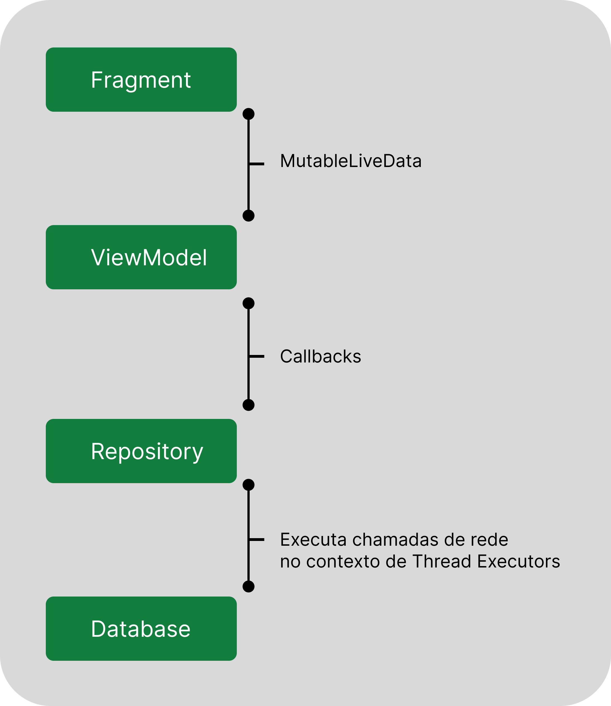
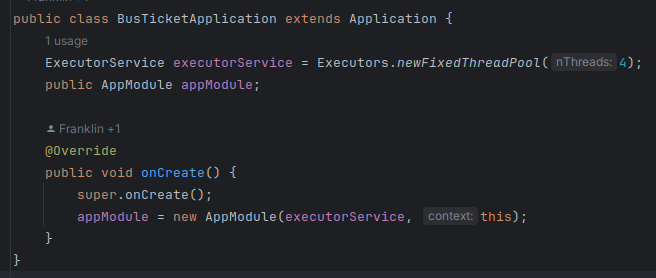
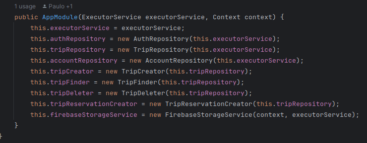
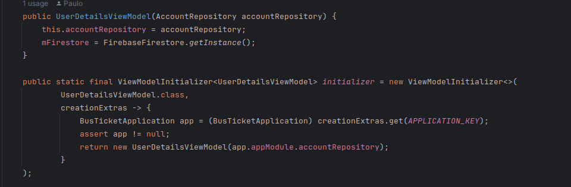
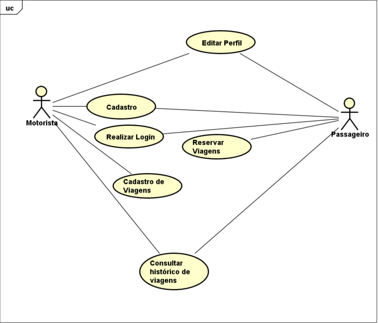

Este projeto utiliza a arquitetura MVVM, o que garante uma melhor organização dos fluxos dentro da aplicação, além de deixar claro as responsabilidades de cada camada da aplicação.
Abaixo são destacados alguns pontos a respeito da arquitetura e como foi empregada no app.

Os fragmentos utilizam os seus respectivos ViewModels para o tráfego de dados, dessa forma, quando um fragmento é aberto, ele delega a responsabilidade de obtenção de dados ao seu ViewModel. O
fragmento é responsavel apenas por atualizar os elementos da UI com as informações obtidas.

Apesar disso, o ViewModel não tem conhecimento da UI, ou seja, não tem acesso ao seu escopo. O modelo de comunicação adotado entre essas duas camadas da arquitetura, consiste na utilização de objetos
do tipo MutableLiveData, o que garante que através de observables a view se mantenha atualizada sempre que um novo valor é emitido pelo produtor, ou seja, o ViewModel.

Conforme designado na arquitetura MVVM (ModelViewViewModel), e seguindo boas práticas, os ViewModels desenvolvidos nesta aplicação não acessam a fonte de dados diretamente. A abordagem adotada coloca
os ViewModels apenas como intermediários nesse processo, delegando esta responsabilidade para a camada de repositórios.
De forma análoga a interaçao entre a View e o ViewModel, o Repository não tem conhecimento do ViewModel. No modelo adotado, foi utilizado do recurso de callbacks, que são acionados sempre que uma
operação que foi solicitada ao Repository é finalizada.

Assim, são os repositórios que de fato fazem as consultas a base de dados, que no nosso cenário, se trata dos serviços do Firebase.

Para evitar bloqueios na Thread da UI, os repositórios realizam essas operações no contexto de Thread Executors.
Quando a aplicação é inicida, a classe BusTicketApplication cria uma instância de ExecutorService com um pool de Threads que são utilizadas sempre que necessário ao longo da aplicação. Assim quando os
repositórios são instanciados na classe AppModule, ele recebem como parametro a instância de ExecutorService responsável por realizar todo o gerenciamento das Threads.

Todos as instâncias definidas no objeto AppModule são criadas apenas uma vez, ou seja, se tratam de instâncias singleton. Os ViewModels obtém as instâncias dos repositórios através do AppModule sempre
que necessário.

Exemplo criando um ViewModel:

Casos de uso:

